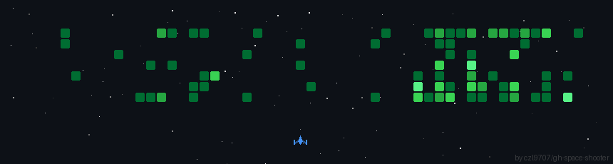

- 👋 Hi, my name is Roman
- 📫 How to reach me rhordiichuk@gmail.com

### Tech Stack

  
  
  
  

### Frontend

  
  
  
  
  

### Backend

  

### Databases

  

### Cloud

  

</img>

<!---
shojchi/shojchi is a ✨ special ✨ repository because its `README.md` (this file) appears on your GitHub profile.
You can click the Preview link to take a look at your changes.
--->
